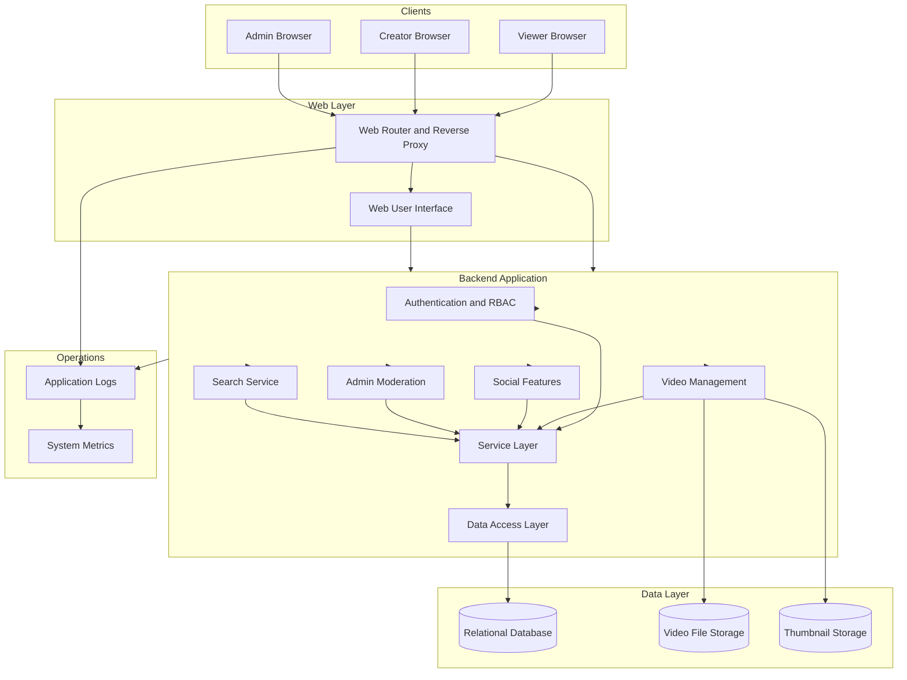

# OOP-Team-B_Youtube-lite
A lightweight YouTube-style application built as an OOP team project.

## System Architecture

## Recomended File Structure
```text
youtube-lite/
├── README.md              # Project overview and setup instructions
├── .gitignore             # Git ignored files
├── .env.example           # Environment variable template
├── requirements.txt       # Python dependencies
│
├── src/
│   └── app/
│       ├── __init__.py   
│       ├── config.py      # Application configuration
│       ├── extensions.py  # Flask extensions (DB, auth, etc.)
│       │
│       ├── models/        # Database entities (DB Lead)
│       │   ├── __init__.py
│       │   ├── user.py
│       │   ├── video.py
│       │   ├── comment.py
│       │   ├── like.py
│       │   ├── subscription.py
│       │   └── report.py
│       │
│       ├── services/      # Business logic layer
│       │   ├── __init__.py
│       │   ├── auth/
│       │   │   └── service.py
│       │   ├── video/
│       │   │   └── service.py
│       │   ├── social/
│       │   │   └── service.py
│       │   └── admin/
│       │       └── service.py
│       │
│       ├── routes/        # Controllers / web endpoints
│       │   ├── __init__.py
│       │   ├── auth/
│       │   │   └── routes.py
│       │   ├── video/
│       │   │   └── routes.py
│       │   ├── social/
│       │   │   └── routes.py
│       │   └── admin/
│       │       └── routes.py
│       │
│       ├── templates/     # HTML templates (UI Lead)
│       │   ├── base.html
│       │   ├── auth/
│       │   ├── video/
│       │   ├── admin/
│       │   └── dashboard/
│       │
│       ├── static/        # CSS, JavaScript, images
│       │   ├── css/
│       │   │   └── style.css
│       │   ├── js/
│       │   └── images/
│       │
│       └── utils/         # Helper utilities
│           ├── __init__.py
│           ├── rbac.py
│           └── decorators.py
│
├── tests/                 # QA / Testing
│   ├── test_auth.py
│   ├── test_video.py
│   ├── test_social.py
│   └── test_admin.py
│
├── scripts/               # Utility scripts
│   ├── seed_db.py
│   └── create_admin.py
│
└── run.py                 # Application entry point

```

## Teammate Area Ownership
The project uses area-based ownership. Each teammate is responsible for a specific subsystem.

### Braulio - Video & Feed (Backend)

**Areas:**
- area: video
- area: social (likes, comments, subscriptions)

**Responsibilities:**
- Video upload, edit, delete
- Video feed and video detail logic
- View counter logic
- Social interactions (likes, comments, subscriptions)

**Primary Code Areas:**
- src/app/routes/video/
- src/app/services/video/
- src/app/routes/social/
- src/app/services/social/
- src/app/models/video.py

### Teammate 2 - Authentication & Roles

**Areas:**
- area: auth

**Responsibilities:**
- User registration, login, logout
- Password hashing
- Role-based access control (Admin, Creator, Viewer)
- Route protection and permission checks

**Primary Code Areas:**
- src/app/routes/auth/
- src/app/services/auth/
- src/app/utils/rbac.py
- src/app/models/user.py

### Mysara/Vinny - Database & Persistence

**Areas:**
- area: db

**Responsibilities:**
- Database schema design
- ORM models and relationships
- Migrations
- Seed data and test scripts

**Primary Code Areas:**
- src/app/models/
- src/migrations/
- scripts/

### Mysara/Vinny - Frontend / UI

**Areas:**
- area: ui

**Responsibilities:**
- Page layout and navigation
- Viewer pages and creator dashboard
- Admin UI pages
- Styling and responsive design

**Primary Code Areas:**
- src/app/templates/
- src/app/static/

### Timothy - QA, Integration & Admin Tools

**Areas:**
- area: admin
- area: testing

**Responsibilities:**
- Admin dashboard and moderation tools
- Integration testing
- Bug fixing and regression testing
- Demo preparation and final presentation support
- In charge of supervising all integration from the developer (dev) branch into the main branch.

**Primary Code Areas:**
- src/app/routes/admin/
- src/app/services/admin/
- tests/
