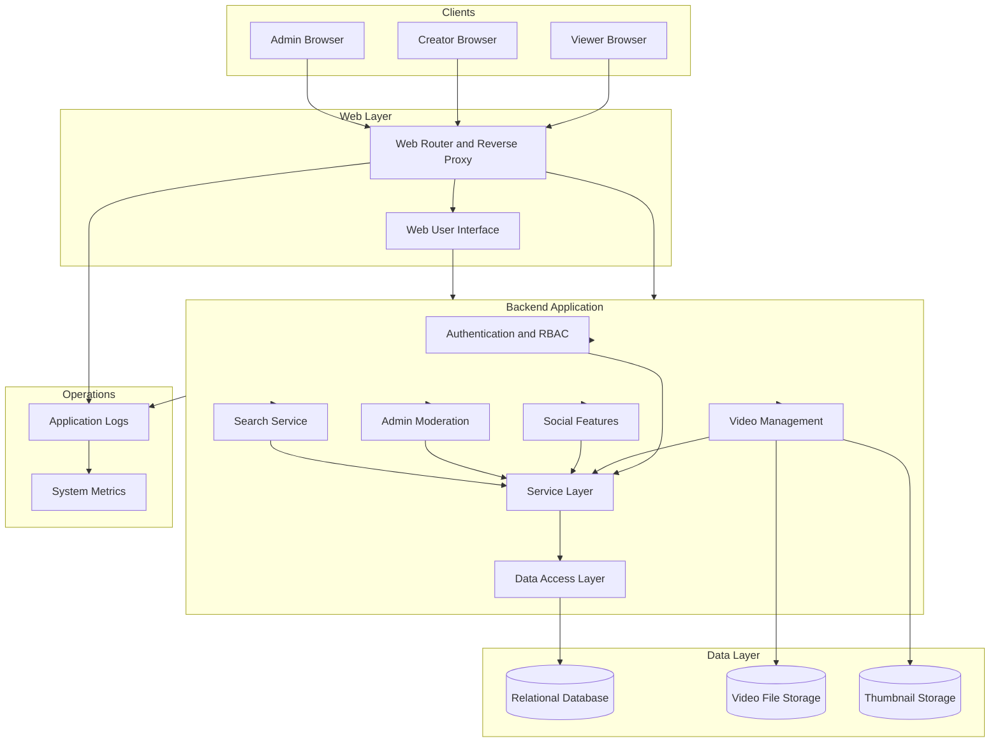

# OOP-Team-B_Youtube-lite
A lightweight YouTube-style application built as an OOP team project.

## System Architecture

```mermaid
flowchart TB

  subgraph C[Clients]
    V[Viewer Browser]
    CR[Creator Browser]
    A[Admin Browser]
  end

  subgraph W[Web Layer]
    R[Web Router and Reverse Proxy]
    UI[Web User Interface]
  end

  subgraph B[Backend Application]
    AUTH[Authentication and RBAC]
    VIDEO[Video Management]
    SOCIAL[Social Features]
    ADMIN[Admin Moderation]
    SEARCH[Search Service]
    SVC[Service Layer]
    DAO[Data Access Layer]
  end

  subgraph D[Data Layer]
    DB[(Relational Database)]
    FS[(Video File Storage)]
    TH[(Thumbnail Storage)]
  end

  subgraph O[Operations]
    LOG[Application Logs]
    MET[System Metrics]
  end

  V --> R
  CR --> R
  A --> R

  R --> UI
  R --> B

  UI --> B

  B --> AUTH
  B --> VIDEO
  B --> SOCIAL
  B --> ADMIN
  B --> SEARCH

  AUTH --> SVC
  VIDEO --> SVC
  SOCIAL --> SVC
  ADMIN --> SVC
  SEARCH --> SVC

  SVC --> DAO
  DAO --> DB

  VIDEO --> FS
  VIDEO --> TH

  B --> LOG
  R --> LOG
  LOG --> MET
```
## Recomended File Structure
```text
youtube-lite/
├── README.md              # Project overview and setup instructions
├── .gitignore             # Git ignored files
├── .env.example           # Environment variable template
├── requirements.txt       # Python dependencies
│
├── src/
│   └── app/
│       ├── __init__.py   
│       ├── config.py      # Application configuration
│       ├── extensions.py  # Flask extensions (DB, auth, etc.)
│       │
│       ├── models/        # Database entities (DB Lead)
│       │   ├── __init__.py
│       │   ├── user.py
│       │   ├── video.py
│       │   ├── comment.py
│       │   ├── like.py
│       │   ├── subscription.py
│       │   └── report.py
│       │
│       ├── services/      # Business logic layer
│       │   ├── __init__.py
│       │   ├── auth/
│       │   │   └── service.py
│       │   ├── video/
│       │   │   └── service.py
│       │   ├── social/
│       │   │   └── service.py
│       │   └── admin/
│       │       └── service.py
│       │
│       ├── routes/        # Controllers / web endpoints
│       │   ├── __init__.py
│       │   ├── auth/
│       │   │   └── routes.py
│       │   ├── video/
│       │   │   └── routes.py
│       │   ├── social/
│       │   │   └── routes.py
│       │   └── admin/
│       │       └── routes.py
│       │
│       ├── templates/     # HTML templates (UI Lead)
│       │   ├── base.html
│       │   ├── auth/
│       │   ├── video/
│       │   ├── admin/
│       │   └── dashboard/
│       │
│       ├── static/        # CSS, JavaScript, images
│       │   ├── css/
│       │   │   └── style.css
│       │   ├── js/
│       │   └── images/
│       │
│       └── utils/         # Helper utilities
│           ├── __init__.py
│           ├── rbac.py
│           └── decorators.py
│
├── tests/                 # QA / Testing
│   ├── test_auth.py
│   ├── test_video.py
│   ├── test_social.py
│   └── test_admin.py
│
├── scripts/               # Utility scripts
│   ├── seed_db.py
│   └── create_admin.py
│
└── run.py                 # Application entry point

```

## Teammate Area Ownership
The project uses area-based ownership. Each teammate is responsible for a specific subsystem.

### Braulio - Video & Feed (Backend)

**Areas:**
- area: video
- area: social (likes, comments, subscriptions)

**Responsibilities:**
- Video upload, edit, delete
- Video feed and video detail logic
- View counter logic
- Social interactions (likes, comments, subscriptions)

**Primary Code Areas:**
- src/app/routes/video/
- src/app/services/video/
- src/app/routes/social/
- src/app/services/social/
- src/app/models/video.py

### Kevin - Authentication & Roles

**Areas:**
- area: auth

**Responsibilities:**
- User registration, login, logout
- Password hashing
- Role-based access control (Admin, Creator, Viewer)
- Route protection and permission checks

**Primary Code Areas:**
- src/app/routes/auth/
- src/app/services/auth/
- src/app/utils/rbac.py
- src/app/models/user.py

### Mysara/Vinny - Database & Persistence

**Areas:**
- area: db

**Responsibilities:**
- Database schema design
- ORM models and relationships
- Migrations
- Seed data and test scripts

**Primary Code Areas:**
- src/app/models/
- src/migrations/
- scripts/

### Mysara/Vinny - Frontend / UI

**Areas:**
- area: ui

**Responsibilities:**
- Page layout and navigation
- Viewer pages and creator dashboard
- Admin UI pages
- Styling and responsive design

**Primary Code Areas:**
- src/app/templates/
- src/app/static/

### Timothy - QA, Integration & Admin Tools

**Areas:**
- area: admin
- area: testing

**Responsibilities:**
- Admin dashboard and moderation tools
- Integration testing
- Bug fixing and regression testing
- Demo preparation and final presentation support
- In charge of supervising all integration from the developer (dev) branch into the main branch.

**Primary Code Areas:**
- src/app/routes/admin/
- src/app/services/admin/
- tests/

# THIS IS WHAT I'VE DONE

### Video Management
- Create videos
- Retrieve all videos
- Retrieve a single video (auto-increments views)
- Update video details
- Delete videos

### Social Features
- Add comments to videos
- Like / Unlike videos (toggle)
- Subscribe to creators

### Backend Architecture
- Flask App Factory Pattern
- SQLAlchemy ORM for database management
- Service Layer abstraction
- Blueprint-based routing
- Modular file structure

### Testing
- Automated testing using **pytest**
- In-memory SQLite database for isolated testing
- Full API test coverage (9 tests passing)

---

## Project Structure

```text
OOP-Team-B_Youtube-lite/
│
├── run.py
├── requirements.txt
├── .gitignore
│
├── src/
│ └── app/
│ ├── init.py
│ ├── config.py
│ ├── extensions.py
│ │
│ ├── models/
│ │ ├── user.py
│ │ ├── video.py
│ │ ├── comment.py
│ │ ├── like.py
│ │ └── subscription.py
│ │
│ ├── routes/
│ │ ├── video/
│ │ │ └── routes.py
│ │ └── social/
│ │ └── routes.py
│ │
│ └── services/
│ ├── video/
│ │ └── service.py
│ └── social/
│ └── service.py
│
└── tests/
├── conftest.py
├── test_video_routes.py
└── test_social_routes.py
```

---

## Setup Instructions

### 1. Clone the repository
```bash
git clone https://github.com/loraencb/OOP-Team-B_Youtube-lite.git
```
```bash
cd OOP-Team-B_Youtube-lite
```
### 2. Create virtual environment

**Windows**
```bash
python -m venv venv
venv\Scripts\activate
```
**Mac/Linux**
```bash
python3 -m venv venv
source venv/bin/activate
```
### 4. Install dependencies
```bash
pip install -r requirements.txt
```
### 5. Run the application
```bash
python run.py
```
Visit:

http://127.0.0.1:5000/

Running Tests
```bash
pytest
```
Expected output:
9 passed

### API Endpoints
**Videos**\n
Method |Endpoint | Description
GET |	/videos/ | Get all videos
GET |	/videos/<id> | Get single video (increments views)
POST | /videos/ |	Create video
PUT | /videos/<id> | Update video
DELETE | /videos/<id> | Delete video
**Social**\n
Method	Endpoint	Description
POST	/social/comments	Add comment
POST	/social/likes/toggle	Like/Unlike video
POST	/social/subscribe	Subscribe to creator

### Example Request
Create Video
curl -X POST http://127.0.0.1:5000/videos/ \
-H "Content-Type: application/json" \
-d '{
  "title": "Test Video",
  "description": "Example",
  "file_path": "/videos/test.mp4",
  "creator_id": 1
}'

### Technologies Used
Python 3.12
Flask
Flask-SQLAlchemy
SQLite
Pytest

## Current Status

- Backend API fully functional
- All tests passing
- Modular architecture implemented
- Frontend integration pending
- Validation and enhancements in progress

## Future Improvements
Input validation (user/video existence checks)
Comment listing per video
Like and subscription counts
Video feed endpoint
Authentication system (login/register)
File upload handling
